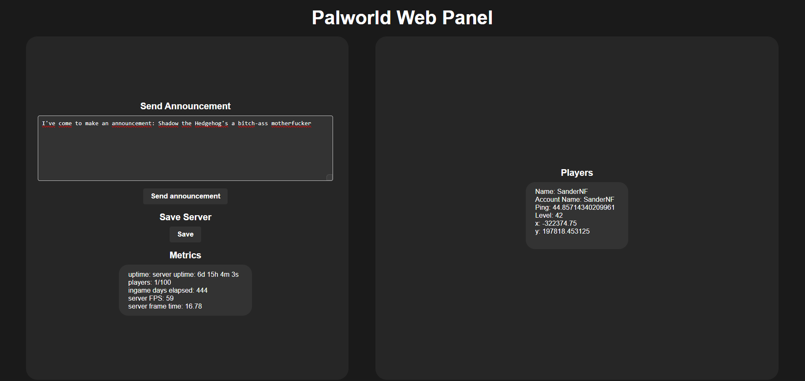
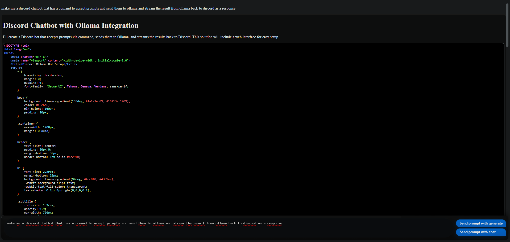

# better palworld panel
a improved manegment panel for palworld (school project)


this runs as a flask website on `x.x.x.x:8213/palworld/`

it comunicates with a local palworld server hosted in a debian LXC container \
this comunication hapens using the rest api on port `:8212`

# better ollama chat panel
a improved chat panel for ollama (school project)


this runs as a flask website on `x.x.x.x:8213/ollama/`

it comunicates with a local ollama server hosted in a debian LXC container \
this comunication hapens using the rest api on port `:11434`

# file structure
```
\static\palworld.css
\static\ollama.css
\templates\palworld.html
\templates\ollama.html
\main.py
\palworldApi.py
\OllamaChatBot.py
\requirements.txt
```
